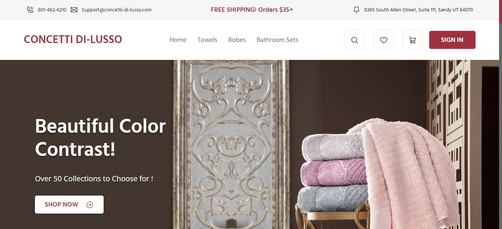

    Ladding Page E-comerce
    

>Status: concluído

## Sobre o projeto
Esse é um projeto de clone de uma ladding page de e-comerce de uma loja de toalhas. Foi um desafio que resolvi realizar para consolidar meus conhecimentos nos conceitos de CSS FlexBox e Grid Layout. Por isso a ladding page está estática, sem nenhuma interação com o usuário(ainda). O objetivo maior desse projeto era a consolidação das aprendizagens em CSS FlexBox e Grid Layout.

## Tecologias
- HTML
- CSS
- Git
- GitHub

## Fontes
Para a realização do projeto, precisei realizar um clone de um modelo de ladding page disponibilizado no [Figma Community](https://www.figma.com/community). Você pode acessar o layout do projeto no Figma através [deste link](https://www.figma.com/file/CdWBsP9yd57dBwY7OSSKvF/E-commerce---Landing-Page-(Community)?type=design&node-id=1-2&t=9i9nEbWBhv4qz21E-0).

Você pode acessar ao projeto funcionando através [deste link](https://vanilson11.github.io/clone-ladding-page/)